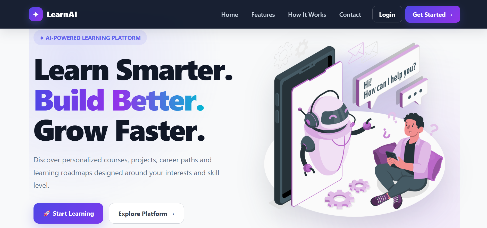
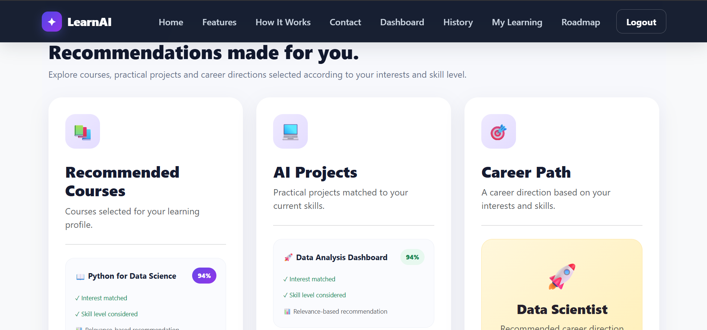
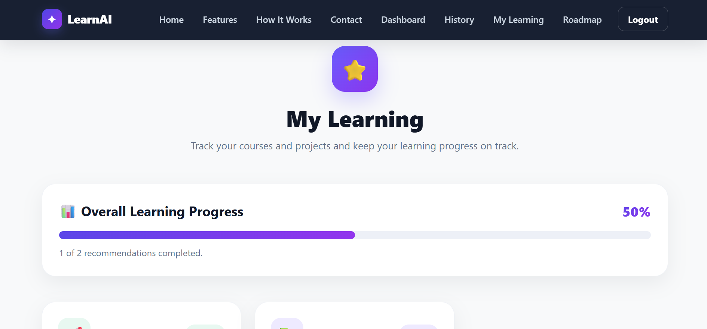
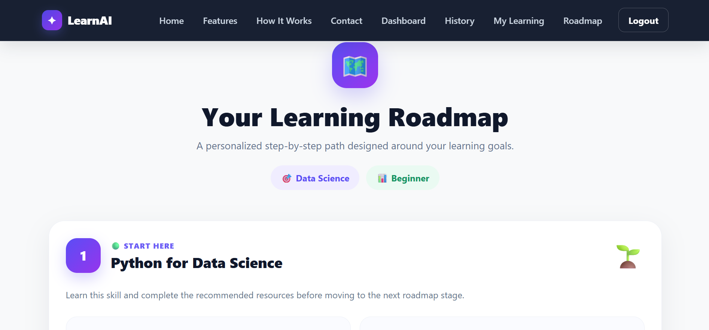
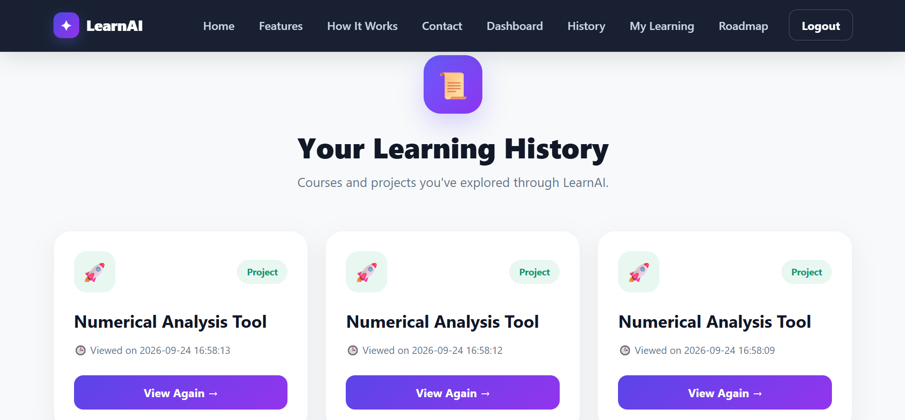

# 🤖 AI Learning Recommendation System

An AI-powered learning recommendation platform that helps students discover personalized courses, projects, learning resources, career paths, and learning roadmaps based on their interests and skill level.

The system combines recommendation algorithms with a modern web interface to provide students with relevant learning opportunities and a structured path for improving their technical skills.

## 🌐 Live Demo

https://ai-learning-recommendation-system-9qq5.onrender.com/

## 👨‍💻 Developed By

**Harsh Singh**  
BTech CSE (Data Science)  
Greater Noida Institute of Technology

## ✨ Features

- 🎯 **Personalized Recommendations**  
  Get course and project recommendations based on your interests and current skill level.

- 🧠 **AI-Based Matching**  
  Uses recommendation and similarity techniques to identify learning resources relevant to the student's profile.

- 📚 **Course Recommendations**  
  Discover suitable courses with difficulty levels, required skills, and learning resources.

- 💻 **Project Recommendations**  
  Find project ideas that match your interests and technical skill level.

- 🗺️ **Personalized Learning Roadmap**  
  Follow a structured roadmap with learning resources and project suggestions.

- 📈 **My Learning Progress**  
  Save recommendations and track your learning progress from one place.

- 🕒 **Recommendation History**  
  Keep track of previously viewed recommendations.

- 👤 **User Profiles**  
  Create an account and receive recommendations based on your selected interests and skill level.

- 🔗 **Learning Resources**  
  Access relevant YouTube videos, GitHub projects, free courses, and paid courses.

- 📱 **Modern Responsive Interface**  
  Clean and responsive UI designed for an easy learning experience across devices.

  ## 🛠️ Technology Stack

### Frontend
- HTML5
- CSS3
- JavaScript
- Bootstrap

### Backend
- Python
- Flask

### Database
- SQLite

### AI / Machine Learning
- Scikit-learn
- Cosine Similarity
- Recommendation algorithms

### Data
- CSV-based course, project, and learning resource datasets

### Deployment
- GitHub
- Render
- Gunicorn

## 🧠 How the Recommendation System Works

The system generates personalized learning recommendations using the student's selected **interest** and **skill level**.

### Recommendation Flow

1. 👤 **User Registration**
   - The student creates an account and selects their area of interest and skill level.

2. 🎯 **User Profile**
   - The system stores the student's interest and skill level.

3. 📊 **Recommendation Processing**
   - The system processes the available course and project data.
   - Recommendation scores are calculated based on the student's profile and available learning content.

4. 🧠 **Similarity Matching**
   - Cosine similarity is used to measure the relevance between the student's profile and available recommendations.

5. 📚 **Personalized Results**
   - The system generates recommended courses, projects, and career paths.

6. 🗺️ **Learning Roadmap**
   - Students can follow a structured roadmap containing learning resources and project suggestions.

7. 📈 **Learning Progress**
   - Students can save recommendations and track their learning progress through the My Learning section.

8. 🕒 **Recommendation History**
   - Previously viewed recommendations are stored so students can access them again.

## 📁 Project Structure

```text
AI_Learning_Recommendation_System/
│
├── database/
│   ├── ai_learning.db
│   └── init_db.py
│
├── dataset/
│   ├── recommendations.csv
│   └── resources.csv
│
├── static/
│   ├── css/
│   ├── js/
│   ├── images/
│   ├── robots.txt
│   └── ...
│
├── templates/
│   ├── base.html
│   ├── index.html
│   ├── login.html
│   ├── register.html
│   ├── dashboard.html
│   ├── recommendation.html
│   ├── history.html
│   ├── my_learning.html
│   └── roadmap.html
│
├── app.py
├── requirements.txt
├── LICENSE
└── README.md

## ⚙️ Installation & Local Setup

### 1. Clone the Repository

```bash
git clone https://github.com/Harsh-SinghTech/AI-Learning-Recommendation-System.git
cd AI-Learning-Recommendation-System

### 2. Create a Virtual Environment

```bash
python -m venv venv

### 3. Activate the Virtual Environment

#### Windows

```powershell
.\venv\Scripts\Activate.ps1
```

If PowerShell activation is restricted, you can also use:

```powershell
.\venv\Scripts\activate
```

### 4. Install Dependencies

```bash
pip install -r requirements.txt
```

### 5. Run the Application

```bash
python app.py
```

The application will be available at:

```text
http://127.0.0.1:5000/
```

### 6. Using VS Code

The project can also be opened directly in VS Code.

Make sure the project's virtual environment is selected as the Python interpreter:

```text
venv\Scripts\python.exe
```

Then run the Flask application using the VS Code Run button or terminal.

## 🚀 Deployment

The application is deployed using **Render**.

### Production Configuration

- **Platform:** Render
- **Application:** Flask
- **Web Server:** Gunicorn
- **Branch:** `main`
- **Build Command:**

```bash
pip install -r requirements.txt
```

- **Start Command:**

```bash
gunicorn app:app
```

### 🌐 Live Application

Visit the deployed application:

https://ai-learning-recommendation-system-9qq5.onrender.com/

## 📸 Screenshots

### 🏠 Home Page



### 📊 Dashboard



### 🎯 Recommendation Details


### 📈 My Learning



### 🗺️ Learning Roadmap



### 🕒 Recommendation History



## 🔮 Future Scope

The project can be further enhanced with:

- 🤖 More advanced machine learning recommendation models
- 🎯 Improved personalization using learning history and user behavior
- 📊 Detailed analytics for tracking learning performance
- 🧭 More comprehensive career and skill roadmaps
- 🔄 Dynamic recommendations based on completed courses and projects
- 🌐 Integration with additional learning platforms and educational APIs
- ☁️ Scalable cloud-based database and infrastructure
- 📱 Further optimization for mobile devices

## 🎓 Project Purpose

This project was developed as an academic and practical implementation of an AI-powered learning recommendation system.

It demonstrates the use of:

- Web application development
- Flask backend development
- Database management
- Recommendation algorithms
- Similarity-based matching
- User progress tracking
- Responsive frontend design

## 📄 License

This project is licensed under the MIT License. See the [LICENSE](LICENSE) file for details.

## 👨‍💻 Author

**Harsh Singh**

BTech CSE (Data Science)  
Greater Noida Institute of Technology

GitHub: [Harsh-SinghTech](https://github.com/Harsh-SinghTech)

## ⭐ Support

If you find this project useful or interesting, consider giving the repository a ⭐ on GitHub.